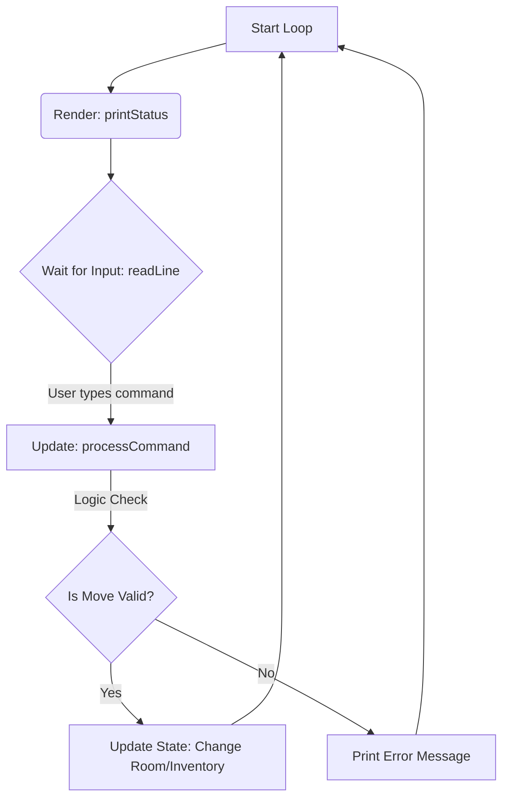

# 🏰 Swift CLI Adventure Game
A text-based adventure game engine built to teach core Swift programming concepts, including control flow, data structures, and JSON parsing.

## 🚀 How to Run
1. Ensure you have **Swift** installed on your machine (`swift --version`).
2. Place `main.swift` and `game.json` in the same folder.
3. Open your terminal/command prompt to that folder.

**Run the game:**

```bash
swift main.swift

```

---

## 🏗 Software Architecture
This application follows a **Data-Driven Design**. Instead of hard-coding rooms and items into the Swift code (e.g., `let room1 = ...`), we load the entire world from an external text file (`game.json`).

### 1. The Software Architecture
The application runs in two distinct phases: **Initialization** (Setup) and **The Game Loop** (Runtime).

#### Phase A: Initialization (The Setup)
Before the player can type anything, the app must build the world.

1. **File I/O (`loadGame`):** The app looks for `game.json` on your hard drive and reads it as raw text data.
2. **Decoding (`Codable`):** The `JSONDecoder` translates that raw text into Swift `Room` structs.
3. **State Population:** The `GameManager` takes those structs and organizes them into a Dictionary (`[String: Room]`) for fast access.

#### Phase B: The Game Loop (The Runtime)
Once the data is loaded, the app enters a `while` loop. This is the heartbeat of the game. It repeats the **"Input-Update-Render"** cycle indefinitely until `isPlaying` becomes false.



1. **Render (`printStatus`):**
* The app looks at the **current state** (Where am I? Is it dark? Is the goblin dead?).
* It prints the description to the console based on that state.

2. **Input (`readLine`):**
* The program **pauses** and waits for the user to type a command and hit Enter.

3. **Update (`processCommand`):**
* **Parsing:** The app splits the input into a **Verb** (move, use) and a **Noun** (north, sword).
* **Logic:** It runs checks (e.g., `if room.locked`).
* **Mutation:** If the logic passes, it updates the **Data Model** (e.g., `currentRoom.locked = false`).

### 2. File Structure
* **`game.json`**: The "Database". It defines the rooms, connections, enemies, and items. You can change the entire game just by editing this file without touching the code.
* **`main.swift`**: The "Logic". It handles the rules of how players interact with the data.

---

## 🔑 Key Swift Language Features
This project demonstrates several critical features of the Swift language:

### 1. Codable (JSON Parsing)
Swift makes reading JSON easy with the `Codable` protocol.

```swift
struct Room: Codable { ... }

```

By making our structs conform to `Codable`, we can convert the JSON file into usable Swift objects in just two lines of code using `JSONDecoder`.

### 2. Optionals & Safety (`?`, `if let`, `guard`)
Swift is designed to be safe. Variables that might be missing are called **Optionals**.

* **`requiresItemToEnter: String?`**: This might be a string (like "torch"), or it might be `nil` (nothing required).
* **`guard let`**: We use this heavily to stop crashes. For example, if a player tries to move "north", we use `guard` to check if a room actually exists to the north. If not, the function stops safely instead of crashing.

### 3. Structs vs. Classes (Value vs. Reference)
* **Struct (`Room`):** We use structs for data. They are "Value Types." When we move them around, they are copied.
* **Class (`GameManager`):** We use a class for the game engine. It is a "Reference Type." We want one single shared instance of the game state that we can modify as we play.

### 4. Dictionaries for Speed
Instead of storing rooms in an **Array** (List), we store them in a **Dictionary** (Map).

```swift
var rooms: [String: Room]

```

* **Array search:** To find a room, the computer has to look at item 1, then item 2, then item 3...
* **Dictionary lookup:** We ask for "cell", and the computer jumps instantly to that memory location. This is much more efficient.

